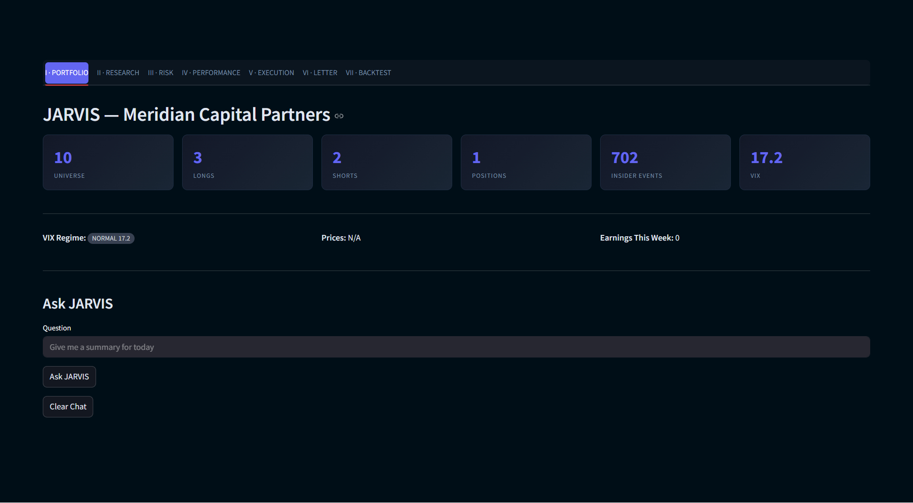
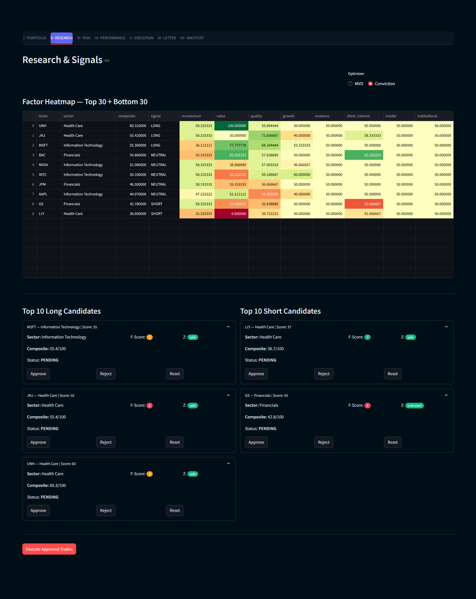
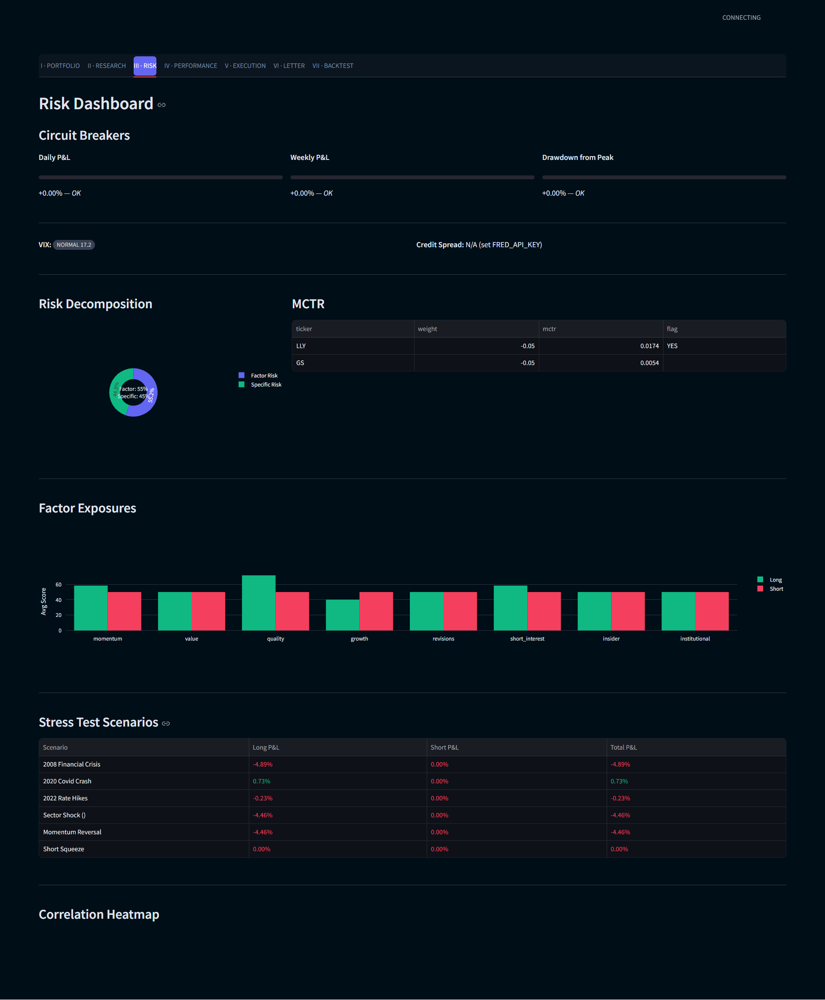
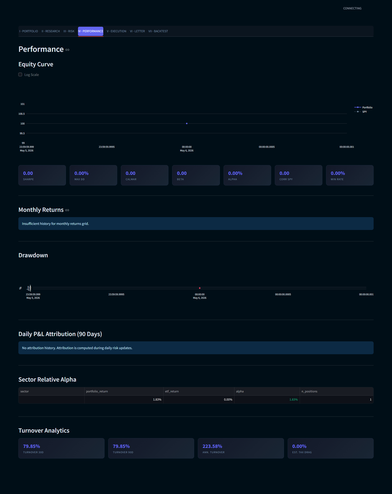
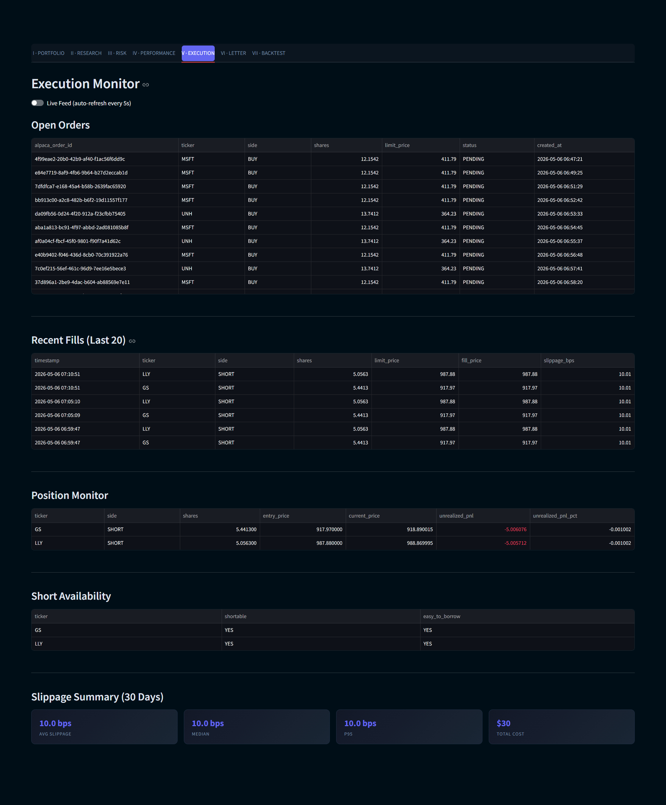
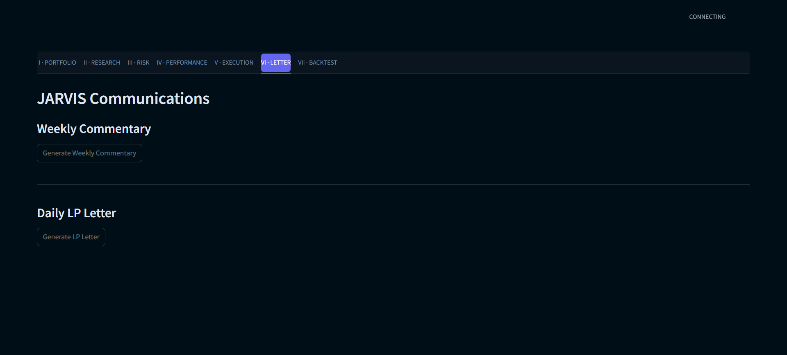
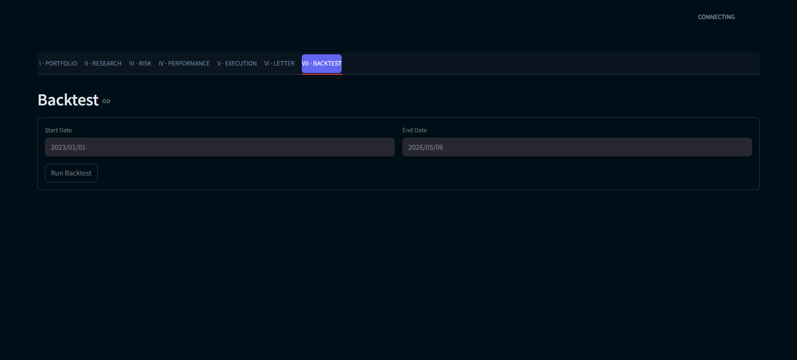

# JARVIS — Long-Short Equity Fund

> **Status:** Under active development. APIs, layer interfaces, and config schema may change without notice. Not investment advice.

A seven-layer long-short equity research and paper-trading system. Quantitative scoring, AI-driven qualitative analysis, mean-variance portfolio construction, risk monitoring, and Alpaca paper execution — all running locally from the command line.

## Inspiration

This project reverse-engineers the system shown in **[How To Turn Claude Into Your Personal Hedge Fund](https://www.youtube.com/watch?v=ANUXcTgrpg0)** by *AI Pathways*. The video walks through using Claude Code to build a complete fund-management stack from scratch. Frame-by-frame analysis of the original Claude Code prompts in that video provided the layer specifications — eight quant factors, the pre-trade veto, the circuit-breaker hierarchy, the MVO + conviction-tilt optimizer, the six-scenario stress test, and the seven-tab Streamlit dashboard.

A few intentional changes from the source:

- **OpenRouter (free Gemini 2.0 Flash) instead of the Anthropic API** — keeps cost at $0 for the personal-project use case. See `docs/architecture/adr/001-openrouter-over-anthropic-api.md`.
- **Backtesting as a standalone utility, not Layer 8** — invoked manually rather than nightly, because of look-ahead and survivorship bias. See `docs/architecture/adr/002-backtesting-as-utility-not-layer.md`.
- **Paper trading by default with two-switch live mode gating** — accidental live trading is structurally prevented. See `docs/architecture/adr/003-paper-trading-only.md`.

## Highlights

- **Seven-layer pipeline.** Data → Scoring → AI analysis → Portfolio → Risk → Execution → Reporting. Each layer is a single `run_*.py` script, idempotent, reading and writing one shared SQLite database.
- **8 factors × 27 subfactors, sector-relative ranking.** Momentum, value, quality, growth, revisions, short interest, insider, institutional. Every score is a percentile against GICS-sector peers, not the full universe — so banks compete with banks and software with software.
- **Piotroski F-Score + Altman Z-Score diagnostics** alongside the quality factor for fast triage.
- **Crowding detection.** 60-day rolling correlation of factor returns flags pairs where too many funds are running the same trade.
- **AI analysis through OpenRouter.** Four LLM analyzers per ticker (filing, earnings, risk, insider) plus a per-sector synthesizer, all OpenAI-SDK-compatible so swapping models takes one config line.
- **Mean-Variance Optimization with constraint fallbacks.** Markowitz `scipy.optimize.minimize` (SLSQP) with hard caps on per-position size, sector exposure, gross, and net beta. Falls back to a conviction-tilt optimizer when MVO is infeasible.
- **Eight-check pre-trade veto.** Halt lock, earnings blackout, liquidity (5% of ADV), position size, sector exposure, gross exposure, net beta, correlation. Closing trades skip checks 2–8 — you can always close.
- **Three-level circuit breakers.** Daily loss, weekly loss, drawdown-from-peak. Kill-switch writes a halt-lock file that all execution paths check.
- **Barra-style cross-sectional factor risk model.** Decomposes portfolio risk into factor risk + specific risk; surfaces marginal contribution to risk (MCTR) per position.
- **Six-scenario stress test.** Three historical (2008 GFC, 2020 COVID, 2022 inflation) plus three synthetic (beta-1 shock, liquidity stress, factor crowding unwind).
- **Alpaca paper trading via `alpaca-py`.** Limit-only orders at ±10 bps, slippage tracked per fill, 30-day rolling stats. Live trading requires both a config switch *and* an explicit verbose env var.
- **Walk-forward backtesting.** Standalone utility with explicit bias caveats (look-ahead in fundamentals, survivorship in universe). Default mode uses momentum-only for clean point-in-time history.
- **Streamlit dashboard** with seven tabs: Portfolio, Research, Risk, Performance, Execution, Letter, Backtest. Dark theme, custom CSS, served on `localhost:8502`.
- **Graceful degradation.** Optional API keys (FMP, Polygon, FRED) fall back to free sources. No `OPENROUTER_API_KEY`? Combined score = quant composite, pipeline still runs. No Alpaca keys? Broker enters `SIMULATED` mode with synthetic fills, downstream layers behave identically.

## Dashboard

Full-page captures of each Streamlit tab on a 10-ticker dev universe.

### I · Portfolio
KPI strip (universe / longs / shorts / positions / insider events / VIX) and the natural-language **Ask JARVIS** assistant.



### II · Research & Signals
Color-graded factor heatmap (8 factors × universe), per-ticker drill-downs with Piotroski F-Score and Altman Z badges, and the inline approve/reject workflow.



### III · Risk Dashboard
Circuit breakers, MCTR table flagging disproportionate risk contributors, factor-exposure bar chart (Long vs Short), and the six-scenario stress matrix.



### IV · Performance
Equity curve (Portfolio vs SPY), seven-card metrics strip (Sharpe / Max DD / Calmar / Beta / Alpha / Corr SPY / Win Rate), monthly-returns grid, and drawdown chart.



### V · Execution Monitor
Live open-orders book with Alpaca order IDs, recent fills with slippage, position monitor, short availability, and 30-day slippage summary.



### VI · Letter
AI-written weekly commentary — VIX regime context, portfolio review, MCTR analysis, factor positioning, and forward-looking outlook. Generated through OpenRouter on demand.



### VII · Backtest
Walk-forward backtest UI with bias-caveat banner, date pickers, num-longs/num-shorts inputs, and run controls.



## Quickstart

```bash
pip install -r requirements.txt
cp .env.example .env
# Edit .env — set SEC_USER_AGENT_EMAIL, optionally OPENROUTER_API_KEY and ALPACA_API_KEY/SECRET

python run_data.py --dev --no-filings --no-13f
python run_scoring.py
python run_dashboard.py
# → http://localhost:8502
```

The `dev_mode: true` setting in `config.yaml` restricts the system to a 10-ticker universe (`AAPL, MSFT, NVDA, INTC, JNJ, UNH, LLY, JPM, GS, BAC`) for fast end-to-end validation. Flip to `false` for the full S&P 500.

Full nightly cycle: see `docs/guides/run-the-full-pipeline.md`.

## Documentation

A complete docs tree lives in `docs/` — 28 files across overview, getting-started, concepts, guides, reference, architecture, and troubleshooting.

| Section | Start here |
|---------|------------|
| New to the project? | [`docs/index.md`](docs/index.md) |
| New to long-short equity? | [`docs/getting-started/onboarding.md`](docs/getting-started/onboarding.md) |
| Want to run it now? | [`docs/getting-started/quickstart.md`](docs/getting-started/quickstart.md) |
| Want to understand a layer? | The matching `docs/concepts/*.md` |
| Hit an error? | [`docs/troubleshooting/common-issues.md`](docs/troubleshooting/common-issues.md) |
| Want to see the design rationale? | [`docs/architecture/system-design.md`](docs/architecture/system-design.md) and the ADRs in `docs/architecture/adr/` |

## Stack

| Component | Choice |
|-----------|--------|
| Language | Python 3.11+ |
| Market data | yfinance (free) |
| Filings + insider data | SEC EDGAR (free; `User-Agent` email required) |
| LLM gateway | OpenRouter via `openai` SDK |
| Default model | `openai/gpt-oss-20b:free` |
| Broker | Alpaca paper trading via `alpaca-py` |
| Optimization | `scipy.optimize.minimize` (SLSQP) |
| Database | SQLite (single file: `data/fund.db`) |
| Dashboard | Streamlit on port 8502 |

## Project structure

```
ls_equity_fund/
├── config.yaml              # All runtime configuration
├── .env.example             # Template for API keys
├── requirements.txt
├── utils.py                 # Shared config / db / logger
├── run_data.py              # Layer 1: data refresh
├── run_scoring.py           # Layer 2: factor scoring
├── run_analysis.py          # Layer 3: AI analysis
├── run_portfolio.py         # Layer 4: portfolio construction
├── run_risk_check.py        # Layer 5: risk dashboard
├── run_execution.py         # Layer 6: Alpaca execution
├── run_dashboard.py         # Layer 7: Streamlit launcher
├── run_backtest.py          # Standalone walk-forward backtest
├── data/                    # Layer 1 modules + fund.db
├── factors/                 # Layer 2 modules (8 factors)
├── analysis/                # Layer 3 modules (4 analyzers + sector + cache)
├── portfolio/               # Layer 4 modules (MVO, conviction, beta)
├── risk/                    # Layer 5 modules (veto, breakers, factor model, stress)
├── execution/               # Layer 6 modules (broker, orders, slippage)
├── reporting/               # Layer 7 reporting modules
├── dashboard/               # Streamlit app
├── output/                  # Scored CSVs, backtest JSONs, per-ticker reports
└── docs/                    # 28-file documentation tree
```

## Status

Personal research project. Not investment advice. Not a production trading system. Every backtest result has acknowledged biases — read `docs/concepts/backtesting.md` before drawing conclusions.

Live trading mode exists but is gated behind two explicit switches that prevent accidental activation. Default and intended use is Alpaca paper trading.

## Credit

- Original concept and Claude Code prompts: **AI Pathways** — *[How To Turn Claude Into Your Personal Hedge Fund](https://www.youtube.com/watch?v=ANUXcTgrpg0)*
- Implementation: built with [Claude Code](https://claude.com/claude-code) (Opus 4.7, 1M context)
